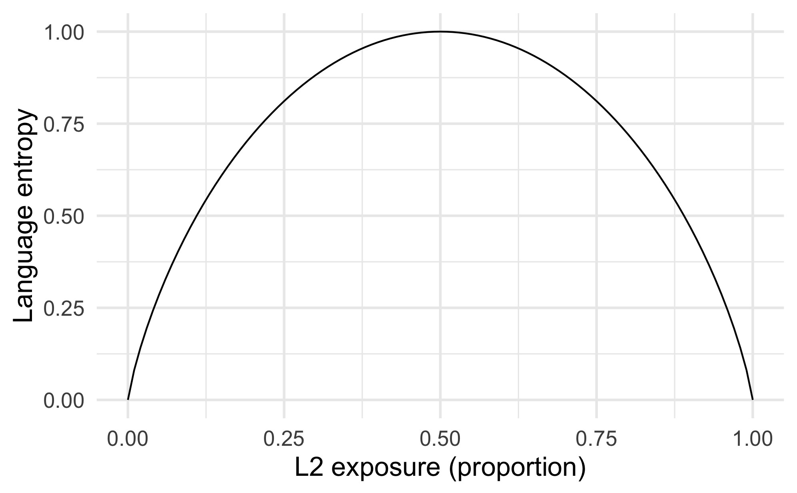

[](https://zenodo.org/badge/latestdoi/142208995)
[](https://travis-ci.org/jasongulilfer/languageEntropy)
```{r setup, include=FALSE}
knitr::opts_chunk$set(echo = TRUE)
library(languageEntropy)
library(ggplot2)
```

Use this package to compute language entropy from language history data. This package and the functions within were developed by Jason Gullifer with conceptual input from Debra Titone. 

If you use this package in your research, please consider citing us:
```{r echo=FALSE}
print(citation("languageEntropy"),bibtex=F)
```

# Frequently asked questions

See the FAQ [here](FAQ.md).

# Overview
In the language sciences, we frequently collect data about language usage in various contexts, such as overall daily exposure to known languages or extent of language use in communicative contexts (e.g., at home, at work, in social settings). However, there is not wide usage of these various measures as covariates or predictors of behavior, despite their practical and theoretical significance. One reason for underuse is that the number of variables related to usage in a multilingual context can be overwhelming. Another reason for underuse is that the distribution of these data may not be ideal for analysis, particularly if they were collected via discrete responses (such as Likert scales). Language entropy helps to solve some of these issues. 

Language entropy is a measure that characterizes the diversity of language usage (or the degree of balance in language usage). Language entropy ranges from 0 to `log(number_of_languages, base=2)`, where 0 represents compartmentalized usage of a single language and `log(number_of_languages, base=2)` represents perfectly balanced usage of each reported language. Below, you can see an example of the theoretical distribution of entropy vs. proportion of L2 exposure (for a situation in which two languages are used).


```{r eval=FALSE, include=FALSE}
L1 <- seq(0,1,.01)
L2 <- rev(L1)
lang<-data.frame(L1=L1,L2=L2)
lang$ent<-apply(lang, FUN=entropy, MARGIN = 1)

ggplot(lang, aes(x=L2, y=ent)) + geom_line() + xlab("L2 exposure (proportion)") + ylab("Language entropy") + theme_minimal(base_size = 16)
#ggsave("inst/images/entropy.png")
```

Language entropy can be computed from the data elicited by language history questionnaires that have become ubiquitous in the field. In recent papers, we have argued that language entropy is an ideal way to measure theoretically relevant variables such as the _social diversity of language usage_ or _inteactional context of langauge usage_ (see e.g. the _Adaptive Control Hypothesis_ by Green & Abutalebi, 2013) in a continuous manner. We have also shown that language entropy relates to various cognitive and neural processes (see Gullifer et al., 2018; Gullifer & Titone, under review). Language entropy generalizes well to multilingual contexts (while reducing the number of variables), and it is distributed continuously. 

# Installation
`languageEntropy` can be installed through `devtools` using the code below.

```{r eval=FALSE, include=TRUE}
# Install devtools package if necessary
if(!"devtools" %in% rownames(installed.packages())) install.packages("devtools")

# Install the development version from github
devtools::install_github("jasongullifer/languageEntropy")
```

# Usage
This package works on subject-level data (i.e., one row per subject, one column per measure). The typical use case will be in computing language entropy (or any entropy really) given a set (or sets) of proportions that sum to 1. For example, in the fake dataset below, we have some language history data for five participants. Specifically, participants reported usage of the native language (L1), second language (L2), and third language (L3) at home, at work, and overall. 

```{r echo=TRUE}
data(entropyExData) # load example data
print(entropyExData)
```
Here, home and work use were elicited via 7-point Likert scales (where 1 represents "no usage at all" and 7 represents "usage all the time"). Overall usage was elicited via data entry in the form of percentages.

We can compute language entropy at home, at work, and for overall usage with the `languageEntropy` package. The general steps are as follows:

1. You must identify contexts of language usage in which to compute entropy (e.g., here we choose home, at work, percent usage). 
2. For each context of usage, convert your data to proportions of language usage. We supply two convenience functions (`likert2prop()` and `percent2prop()`) to convert Likert scales and percentages to proportions. Note: proportions should sum to 1 within each context of usage.
3. For each context of usage, compute language entropy using `languageEntropy()`. 

Note: The functions `likert2prop()` and `languageEntropy()` include an input argument, `colsList` which allows the user to specify independent contexts of usage as separate items in a list. Entropy / proportions will be calculated independently for each context without necessitating the user to run the function several times. In the case of `percent2prop()`, percentages are computed by dividing each observation by 100, and therefore, the function needs no knowledge of the context of usage. 

## Load example dataset
```{r}
library(languageEntropy)
data(entropyExData) # load example data
print(entropyExData)
```

## Step 1: Identify contexts of usage.
We will compute entropy independently for the home context, the work context, and percent language usage. 

## Step 2: Convert data to proportions for each context
In the example dataset, some data are represented by Likert scales and some are represented by percentages. Both types of data need to be converted to proportions.

For Likert data, the following is a concrete example of the conversion process. A participant (e.g., Subject 1) might report the following usage pattern at home: L1: 7 (all the time), L2: 7 (all the time), L3: 4 (sometimes). First, we rebaseline the Likert scale to 0, so that a score of 0 reflects "no usage", resulting in: L1: 6, L3:6, L3: 3. Next, each rebaselined usage is divided by the sum total (15), resulting in the following proportions of language usage at home, L1: 6/15, L2: 6/15, L3: 3/15.

The following R code does this for each subject in the home context. You must specify the dataset (here, `entropyExData`), the subject ID column (here, `sub`), and the columns that contain the context-specific Likert data (here, `L1home`, `L2Home`, and `L3home`) You can see the output contains three new variables (with `_prop` appended to the column names).
```{r}
entropyExData <- likert2prop(entropyExData, sub, L1Home, L2Home, L3Home)
print(entropyExData)
```

Next, we will convert the data from the work context. 
```{r}
entropyExData <- likert2prop(entropyExData, sub, L1Work, L2Work, L3Work)
print(entropyExData)
```

Alternatively, `likert2prop()` can be told to separate the contexts and work on them individually within one command. This can be done by passing home and work usages as separate vectors within a list to the `colsList` argument.
```{r}
data(entropyExData) # reload example data
entropyExData <- likert2prop(entropyExData, sub, colsList = list(c("L1Home", "L2Home", "L3Home"), 
                                                                 c("L1Work", "L2Work", "L3Work")))
print(entropyExData)
```

Now we will convert the percentages to proportions with the helper function `percent2prop()`.
```{r}
entropyExData <- percent2prop(entropyExData, L1PercentUse, L2PercentUse, L3PercentUse)

print(entropyExData)
```

## Step 3: Compute language entropy for each context
Now that we have percentages, we can compute language entropy for each context of usage with `languageEntropy()`. This function works similarly to `likert2prop()`.

Compute entropy for the home context. We again specify the dataset (`entropyExData`), the subject ID column (`sub`), and the columns that contain context-specific proportions (`L1Home_prop`, `L2Home_prop`, and `L3Home_prop`). You should also supply the `contextName` arguments, which allows `languageEntropy()` to give your new entropy column a name. 
```{r}
entropyExData <- languageEntropy(entropyExData, sub, L1Home_prop, L2Home_prop, L3Home_prop, 
                                 contextName = "Home")
print(entropyExData)
```

Now we do the same for the work context.
```{r}
entropyExData <- languageEntropy(entropyExData, sub, L1Work_prop, L2Work_prop, L3Work_prop, 
                                 contextName = "Work")
print(entropyExData)
```

No we do the same for overall use.
```{r}
entropyExData <- languageEntropy(entropyExData, sub, L1PercentUse_prop, L2PercentUse_prop, L3PercentUse_prop, 
                                 contextName = "PercentUse")
print(entropyExData)
```

Alternatively, `languageEntropy()` can be told to separate the contexts and work on them individually within one command. This can be done by passing all the contexts as separate vectors within a list to the `colsList` argument.
```{r}
entropyExData <- languageEntropy(entropyExData, sub, 
                                 colsList = list(Home=c("L1Home_prop", "L2Home_prop", "L3Home_prop"),
                                                 Work=c("L1Work_prop","L2Work_prop","L3Work_prop"),
                                                 PercentUse=c("L1PercentUse_prop", "L2PercentUse_prop",
                                                              "L3PercentUse_prop")))
print(entropyExData)
```

# References
Gullifer, J. W., Chai, X. J., Whitford, V., Pivneva, I., Baum, S., Klein, D., & Titone, D. (2018). Bilingual experience and resting-state brain connectivity: Impacts of L2 age of acquisition and social diversity of language use on control networks. _Neuropsychologia_, _117_, 123–134. http://doi.org/10.1016/j.neuropsychologia.2018.04.037

Green, D. W., & Abutalebi, J. (2013). Language control in bilinguals: The adaptive control hypothesis. _Journal of Cognitive Psychology_, _25_, 515–530. https://doi.org/10.1080%2F20445911.2013.796377

Gullifer, J. W., & Titone, D. (under review). Characterizing the social diversity of bilingualism using language entropy. _Bilingualism: Language and Cognition._ http://doi.org/10.1017/S1366728919000026

# Acknowledgments
This work was supported by the Natural Sciences and Engineering Research Council of Canada (individual Discovery Grant, 264146 to Titone); the Social Sciences and Humanities Research Council of Canada (Insight Development Grant, 01037 to Gullifer & Titone); the National Institutes of Health (Postdoctoral training grant, F32-HD082983 to Gullifer, Titone, and Klein); the Centre for Research on Brain, Language & Music.

Special thanks to [Ashley M. DaSilva](https://github.com/adasilva), [Denise Klein](https://www.mcgill.ca/denise-klein-lab/lab), Pauline Palma, [Mehrgol Tiv](https://github.com/mehrgoltiv), [Janet Van Hell](http://bild.la.psu.edu/people/principal-investigator), [Robert D. Vincent](http://www.bic.mni.mcgill.ca/users/bert/), Naomi Vingron, and Junyan Wei for fruitful discussions regarding (language) entropy and the social diversity of language usage. 

